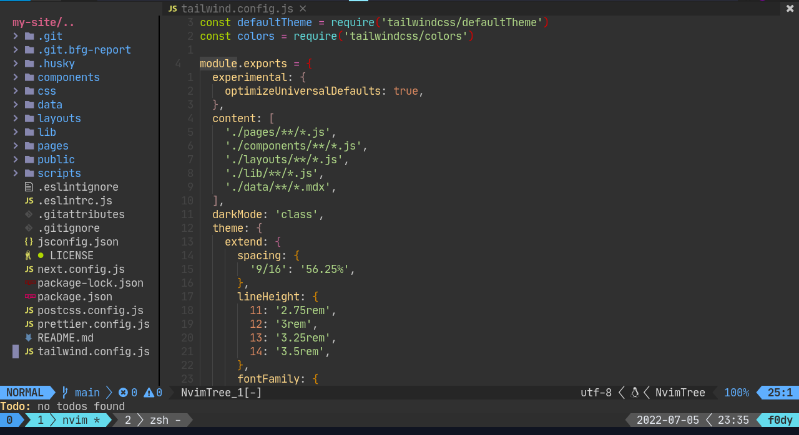

<div align="center"><p>
    <a href="https://github.com/fadyio/nvim/pulse">
      
    </a>
    <a href="https://github.com/fadyio/nvim/LICENSE">
      
    <a href="https://patreon.com/chrisatmachine" title="Donate to this project using Patreon">
      
    </a>
    <a href="https://twitter.com/intent/follow?screen_name=chrisatmachine">
      
    </a>
</p>


# Short Intro


This is my NeoVim config (for version 0.7 and greater).

* Autocompletion 
* Highlighting 
* Navigation
    * Find definition/declaration/implementation...
    * Find all references (of variables, methods, classes...)
    * Jump cursor focus forward/backward in time
    * Project tree view (NvimTree)
    * Switch between tabs
* Searching
    * Search by file name
    * Search by file contents
    * Search through NeoVim's help
* Refactoring (code actions)
    * Rename (variable, method, class...)
    * Automatically import
    * Simplify code
    * Infer type info
* Diagnostics
    * Show errors/warnings/hints/info
    * Diagnostic panel
    * Integration with status line
* Git
    * Highlight edited lines in number column
    * Navigate between hunks (changes)
    * Stage/unstage hunks
    * Preview old code
    * Status line integration
* Misc
    * Special start page
    * Indent guide lines
    * Motions for surrounding characters (brackets, parentheses...)
    * Easy commenting out code
    * Pretty status line
    * Default colorscheme
    * Enabled mouse integration
    * Keymappings for 10 finger typing on Slovene keyboard
## Backup your NeoVim config before install this one.

## Installation
1. Download this repo
```bash
git clone git@github.com:fadyio/nvim.git
```
2. Put the contents of this repo where NeoVim can find them. On Linux this is most likely `$HOME/.config/nvim`.
On Linux this is `$HOME/.local/share/nvim`. Otherwise check the output of `:lua print(vim.fn.stdpath('data'))`.
3. Open NeoVim and let it install Packer and all the dependencies (ignore the errors).
4. Open NeoVim again and wait for nvim-treesitter to install all of its dependencies (ignore the errors).

If you're updating an existing config and you're facing some issues,
I would recommend that you remove the contents of *data* folder and retry the installation. (It has helped me in the past)

## Icons
Icons and other special characters are used all around the config to give NeoVim a prettier look.
However, your terminal will not display these icons correctly unless it uses the correct font.

Install one of the icon fonts listed [here](https://www.nerdfonts.com/). Just follow their instructions for your specific OS.
After installation is complete, don't forget to configure your terminal to start using the new font. 
Each terminal does this differently, so be sure to checkout [Arch Wiki](https://wiki.archlinux.org/) if you run into any troubles.


